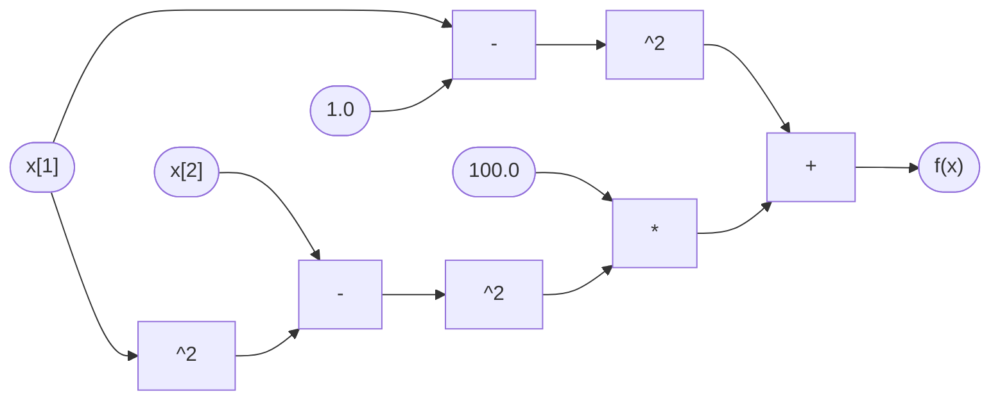

# computational-graph-tools
A Julia module for automatically constructing the computational graph/tape of a supplied composite function, and an implementation of the reverse mode of automatic differentiation (AD) that operates on this graph to either: 

- efficiently compute adjoint derivatives, or 
- generate MATLAB code that computes adjoint derivatives. 

These implementations are designed to be relatively straightforward to understand and adapt, and  without depending on any packages external to Julia.

Beyond the reverse AD mode, the following numerical methods require access to a function's computational graph, and could be implemented using the `CompGraphs` module provided here:

- [reverse propagation of subgradients](https://doi.org/10.1007/978-3-642-30023-3_10) of McCormick convex relaxations (Beckers et al., 2012)
- [reverse McCormick relaxations](https://doi.org/10.1007/s10898-015-0303-6) that handle equality constraints (Wechsung et al., 2015)
- [the "cone-squashing" method](https://doi.org/10.1145/2491491.2491493) for generalized derivative evaluation for nonsmooth functions (Khan and Barton, 2013); this method provides more information but is less efficient than the later [nonsmooth vector forward AD mode](https://github.com/kamilkhanlab/nonsmooth-forward-ad) (Khan and Barton, 2015).
- [the "branch-locking" method](https://doi.org/10.1080/10556788.2017.1341506) for efficient generalized derivative evaluation for nonsmooth functions (Khan, 2018), which borrows many of the benefits of the smooth reverse AD mode, and extends to implicit functions and inverse functions.

Tested in Julia v1.4.1.

## Computational graph generation
The module `CompGraphs` in [CompGraphs.jl](src/CompGraphs.jl) is a facility for building the computational graph for a composite function.

### What's a computational graph?
A computational graph represents a composite function as its individual elemental operations, keeping track of when the output of one operation is an input of another. Some numerical methods require a function to be represented as a computational graph. For example, consider the following composite function (from Example 2.2 of Naumann (2012)):
```julia
f(x) = (1.0 - x[1])^2 + 100.0*(x[2] - x[1]^2)^2
```
This function is not intrinsic to Julia, but does depend on various elemental "scientific calculator" operations that Julia understands. We could reformulate `f` to explicitly consider these elemental operations one by one in a recipe:
```julia
function f(x)
  v = zeros(12)

  # load inputs
  v[1] = x[1]
  v[2] = x[2]

  # evaluate elemental operations one by one
  v[3] = 1.0
  v[4] = v[3] - v[1]
  v[5] = v[4]^2
  v[6] = v[1]^2
  v[7] = v[2] - v[6]
  v[8] = v[7]^2
  v[9] = 100.0
  v[10] = v[9]*v[8]
  v[11] = v[5] + v[10]
  v[12] = v[11]

  # recover output
  return v[12]
end
```
This is the same function `f` as before. A computational graph of `f` is a directed acyclic graph with one node for each intermediate quantity `v[i]` in this representation. Each node `v[i]` "knows" its index `i` and the mathematical operation that it corresponds to, and is connected by an edge from each previous node `v[j]` that was an input of this operation:


### Implementation overview
The module `CompGraphs` in [CompGraphs.jl](src/CompGraphs.jl) exports the definitions of two parametric structs: `CompGraph{T, P}` and `GraphNode{P}`. A `CompGraph` is intended to hold the computational graph of a single composite function, and is made up of `GraphNode`s. The parametric types `T` and `P` are intended to hold application-specific data, respectively pertaining to the overall graph and particular nodes. 

#### Fields of `GraphNode{P}`:

- `operation::Symbol`: the mathematical operation described by the node (e.g. `:+`). The supported operations are listed in `unaryOpList`, `standardBinaryOpList`, and `customBinaryOpList` in [CompGraphs.jl](src/CompGraphs.jl).
- `parentIndices::Vector{Int}`: list of indices of parent nodes, representing inputs of this node's `operation`.
- `constValue::Union{Float64, Int}`: holds operation-specific constants such as the constant integer exponent `3` in the cube operation `f(x) = x^3`. Most operations don't use this field.
- `data::P`: any application-specific data or computational results pertaining to this particular node. The parameter `P` may represent e.g. a user-defined mutable struct.

#### Fields of `CompGraph{T, P}`:

- `nodeList::Vector{GraphNode{P}}`: holds the nodes of the graph.
- `domainDim::Int`: domain dimension of the represented function.
- `rangeDim::Int`: range dimension of the represented function.
- `data::T`: any application-specific data or results that are not specific to one particular node.

#### Exported functions:

- `load_function!(f::Function, graph::CompGraph{T, P}, initP::P) where {T, P}`: 
  -   modifies `graph` to contain a computational graph for the
      composite function `f`. Each resulting `GraphNode`'s `data`
      field is initialized with the value `deepcopy(initP)`. The
      computational graph is generated using operator overloading,
      passing in an internal `GraphBuilder` object in place of any
      `Float64`. So, `f` must be written as if it takes a
      `Vector{Float64}` input, and returns either a `Float64` or
      `Vector{Float64}` output, but without actually specifying that
      these input/outputs are `Float64`s.
	  
  - Also permits a keyword argument `shouldMaxBeChangedToAbs::Bool`
    (default: `false`). If true, then `max` and `min` are rewritten in
    terms of `abs` before being appended to the computational graph,
    using the identities:
	
	```julia
	max(x,y) == 0.5*(x + y + abs(x-y))
	min(x,y) == 0.5*(x + y - abs(x-y))
	```

- `is_function_loaded(graph::CompGraph)::Bool`: 
  - checks if a composite function has already been loaded into `graph`, by confirming that `graph.nodeList` is nonempty.

The following constructor for `CompGraph` is available in addition to the usual default constructor: 

- `CompGraph{T, P}(domainDim::Int, rangeDim::Int) where {T, P}`: requires that a constructor `T()` (with no arguments) is available to provide a value for `this.data`. 

## Reverse AD mode implementation
The module `ReverseAD` in [ReverseAD.jl](src/ReverseAD.jl) contains a straightforward implementation of the standard reverse mode of automatic differentiation (AD) for smooth functions, as described by Griewank and Walther (2008). The reverse AD mode evaluates gradients/derivatives for composite functions at a computational cost which doesn't scale with the function's domain dimension. This implementation operates on a `CompGraph` and requires `CompGraphs.jl` in the same directory. It is intended to show how `CompGraphs.jl` may be used for numerical computation. 

### Overview
The features of the `ReverseAD` module are illustrated in [testRevMode.jl](test/testRevMode.jl). The module exports the following functions:

- `tape = record_tape(f::Function, domainDim::Int, rangeDim::Int)`: 

  - returns an AD-amenable "tape" for the provided function `f`. This tape is secretly just a specialized `CompGraph`. The domain and range dimensions for `f` must be provided, and `f` must be of the format required by `CompGraphs.load_function!`. 

- `(y, xBar) = reverse_AD!(tape::CompGraph, x::Vector{Float64}, yBar::Vector{Float64})`: 

  - performs the reverse mode of AD on the output `tape` of `record_tape`. With `f` denoting the recorded function, this returns `y = f(x)` and `xBar = (Df(x))'*yBar`. In particular, if `f` is scalar-valued and `yBar = [1.0]`, then `xBar` is the gradient of `f` at `x`. The `data` fields of `tape` and its nodes are used to hold results of intermediate computations.

- `generate_revAD_matlab_code!(tape::CompGraph, tapedFuncName::AbstractString = "f", fileName::AbstractString = tapedFuncName * "RevAD")`

  - creates a MATLAB script `fileName.m` containing a function `fileName`, which carries out the reverse AD mode for the composite function recorded in `tape` by `record_tape`. The input `tapedFuncName` specifies how this composite function is named in MATLAB comments. Automatically generating MATLAB code for the reverse AD mode is difficult using MATLAB alone; this function illustrates how to use a `CompGraph` for code generation.

### Example
The usage of `ReverseAD` is illustrated by the script [testRevMode.jl](test/testRevMode.jl), which can be run from the terminal if this repository is cloned. Consider again the following function, with a domain dimension of `2` and a range dimension of `1`.
```julia
function f(x)
  y = (1.0 - x[1])^2
  y += 100.0*(x[2] - x[1]^2)^2
  return y
end
```

We may generate an AD tape for `f` by any of the following methods, after `using .ReverseAD`. We may define `f` in advance and then load it into `record_tape`:
```julia
function f(x)
  y = (1.0 - x[1])^2
  y += 100.0*(x[2] - x[1]^2)^2
  return y
end
tape = record_tape(f, 2, 1)
```
Or, we may load it in as a one-liner anonymous function:
```julia
tape = record_tape(x -> (1.0 - x[1])^2 + 100.0*(x[2] - x[1]^2)^2, 2, 1)
```
Or, we may use Julia's `do` syntax, which might be handy for longer anonymous functions:
```julia
tape = record_tape(2, 1) do x
  y = (1.0 - x[1])^2
  y += 100.0*(x[2] - x[1]^2)^2
  return y
end
```
At this point, we may perform the reverse AD mode on `tape`. The following command computes the gradient `xBar` of `f` at `[2.0, 2.0]`:
```julia
_, xBar = reverse_AD!(tape, [2.0, 2.0], [1.0])
```
Alternatively, the following command generates a MATLAB file `fRevAD.m` that performs the reverse AD mode on `f`:
```julia
generate_revAD_matlab_code!(tape)
```
The file generated by this command is included in this repository as [fRevAD.m](test/fRevAD.m).

## References

- A Griewank and A Walther, *Evaluating Derivatives: Principles and Techniques of Algorithmic Differentiation (2nd ed.)*, SIAM, 2008.
- U Naumann, *The Art of Differentiating Computer Programs: An Introduction to Algorithmic Differentiation*, SIAM, 2012.


